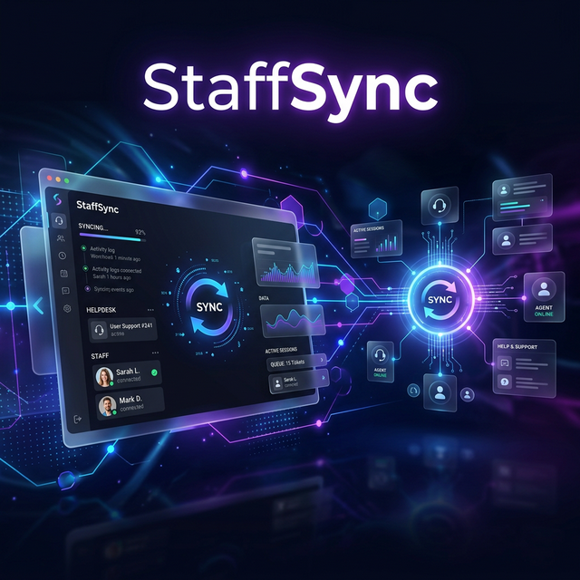

# 🚀 StaffSyncAPI - Enterprise Helpdesk & Staff Management



StaffSyncAPI is a robust, modern, and high-performance Helpdesk and Staff Management system. Built with a PHP-powered backend and a sleek Tailwind CSS frontend, it offers a complete solution for managing support tickets, departments, and team communications.

---

## ✨ Key Features

- **🎫 Advanced Ticket Management**: Create, track, and resolve support tickets with ease.
- **💬 Real-time Messaging**: Seamless communication between staff and customers.
- **📊 Interactive Dashboard**: At-a-glance overview of ticket statuses and performance metrics.
- **🏢 Department Organization**: Manage multiple departments and assign specialized staff.
- **🔐 Secure Authentication**: Multi-layered security with session management and CSRF protection.
- **🌓 Modern UI**: Sleek glassmorphism design with full Dark/Light mode support.
- **⚡ Fast Performance**: Optimized PHP API backend for lightning-fast responses.

---

## 🛠️ Tech Stack

### Backend
- **Core**: PHP 8.x
- **Database**: PostgreSQL / MySQL (Selectable)
- **API Architecture**: RESTful with custom Routing & Middleware

### Frontend
- **Framework**: Tailwind CSS (Latest)
- **Engine**: Pure JavaScript (ES6+)
- **Typography**: Inter & Geist Fonts
- **Aesthetics**: Glassmorphism, Dynamic Animations, Soft Shadows

---

## 📁 Project Structure

```bash
StaffSyncAPI/
├── api/                # Core PHP Backend
│   ├── middleware/     # Auth & Security Layers
│   ├── routes/         # API Endpoints (Tickets, Users, Auth)
│   ├── config.php      # System Configuration
│   └── db.php          # Database Connection logic
├── assets/             # Frontend Static Assets
│   ├── css/            # Custom Styles
│   ├── js/             # Application Logic (api.js, app.js)
│   └── banner.png      # Project Branding
├── database/           # SQL Schemas & Migrations
├── index.html          # Main Application Entry Point
└── tailwind.config.js  # UI Design System Tokens
```

---

## 🚀 Getting Started

### Prerequisites
- PHP 8.0 or higher
- A compatible database (MySQL/PostgreSQL)
- Web Server (Apache/Nginx/Localhost)

### Installation
1. **Clone the repository**:
   ```bash
   git clone https://github.com/aloostor/StaffSyncAPI.git
   cd StaffSyncAPI
   ```
2. **Configure Database**:
   Update `api/config.php` with your database credentials.
3. **Initialize Database**:
   Import the SQL schema from the `database/` folder.
4. **Create Test Users**:
   Run the utility script to set up demo accounts:
   ```bash
   php create_test_users.php
   ```
5. **Launch**:
   Open `index.html` via your web server (e.g., `http://localhost/StaffSyncAPI`).

---

## 🤝 Contributing

Contributions are welcome! Please feel free to submit a Pull Request.

---

## 📄 License

This project is licensed under the ISC License.

---

Developed with ❤️ for the community.
